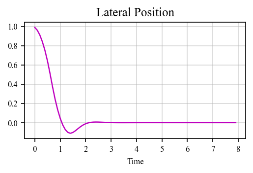
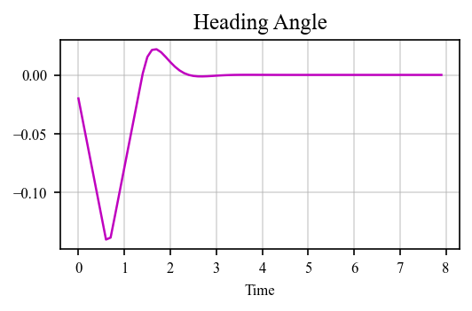
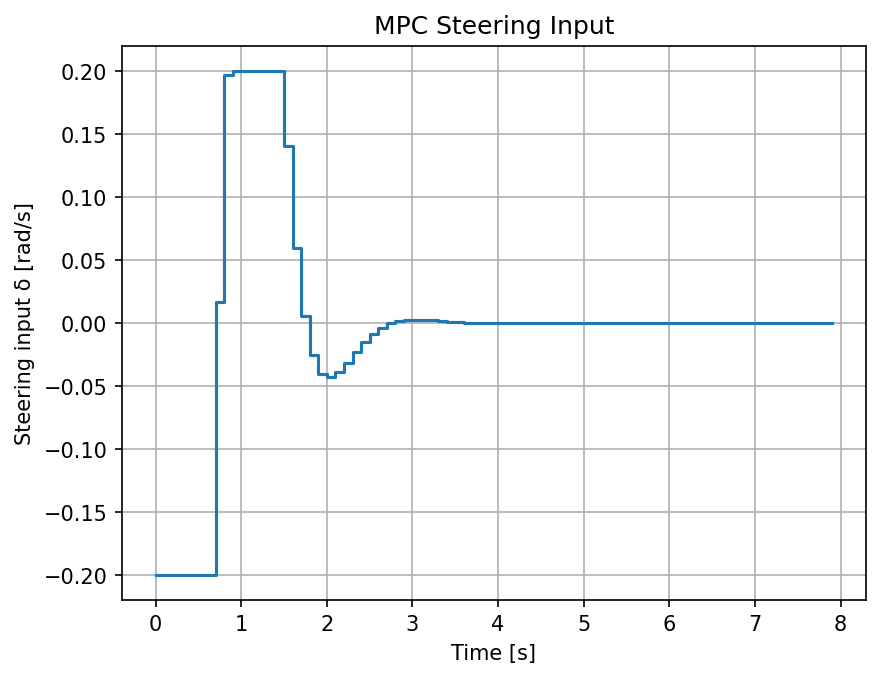

# Vehicle steering control using MPC

This project implements a Model Predictive Controller (MPC) for the steering control of a vehicle using the [c4dynamics](https://github.com/c4dynamics/c4dynamics) library.

The goal is to control the lateral position **(y)** and heading angle **(ψ)** of a vehicle to track a straight line using steering input **(δ)**.

---

## System Model

We consider a simplified kinematic model of a vehicle with 2 states `[ψ ; y]`:

$\dot{\psi}(t) = \delta$(t)

$\dot{y}(t) = V\psi$(t)
  
where:  
- `y` = lateral position [m]  
- `ψ` = heading angle [rad]  
- `V` = velocity [m/s]  
- `δ` = steering input [rad/s]  

Discretize model

$\psi(t+1) = \psi(t) + \delta(t)dt$ 

$y(t+1) = y(t) + \psi(t) Vdt + \delta(t)0.5Vdt^2$


---

## Pseudocode

```text
Import required libraries: c4dynamics, numpy, matplotlib, etc

Define model parameters: V
Define initial states: y0, ψ0
Define simulation parameters: dt, t_end
Define controller parameters: N, Q, R
Define constraints: delta_max

Define vehicle model function: vehicle_model()
Define MPC function: A & B matrices, solver, etc

Initialize vehicle state object: y0, ψ0

Main loop:
    Store current state: vehicle.store
    Compute optimal steering using MPC:
    Apply control input to vehicle: vehicle.X = solve_ivp or discrete model
    Update vehicle state:
        
Plot: lateral position (y), heading (ψ) and control input (δ)
```
---

## Results

- Lateral position (`y`) is driven from the initial offset (`y0 = 1.0 m`) toward zero; the controller reduces the lateral error within a few seconds and stabilizes near the reference.



- Heading angle (`psi`) shows a transient response as the controller rotates the vehicle to correct lateral error, then converges toward small values once `y` is near zero.



- Steering input (`δ`) exhibits an initial corrective action (bounded by `u_max`) and then settles close to zero as the vehicle reaches the desired lateral position.



These results indicate the MPC successfully commands the steering rate to remove the initial lateral offset while respecting the input bound.

---

## References

[MPC - Standford lecture](https://web.stanford.edu/class/archive/ee/ee392m/ee392m.1056/Lecture14_MPC.pdf)